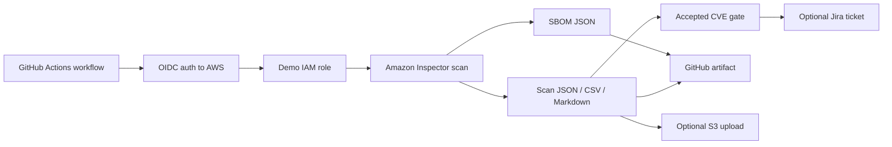
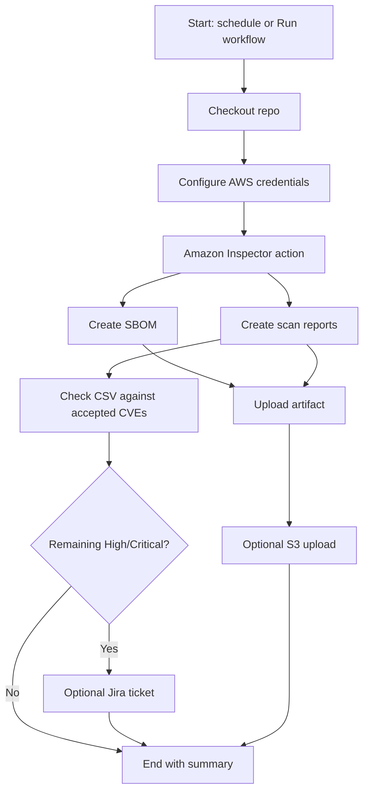

# SBOM Scan Toolkit

Small demo repo that shows how a GitHub Actions workflow can generate an SBOM, ask Amazon Inspector to analyze the repository, save the results, and optionally open a Jira ticket.

This repo is for **explanation and demo**. The AWS account, IAM role, S3 bucket, Jira URL, and SSM paths are fake placeholders.

## Architecture

## What this workflow does

The workflow is in `.github/workflows/sbom-scan.yml`.

On a scheduled or manual run it:

1. checks out the repo
2. authenticates from GitHub Actions to AWS with OIDC
3. runs the Amazon Inspector GitHub Action
4. generates an SBOM plus scan outputs in JSON, CSV, and Markdown
5. removes accepted CVEs listed in `sbom-accepted-cves.json` from the CSV-based gate
6. uploads the outputs as a GitHub artifact
7. optionally uploads the files to S3
8. optionally creates a Jira ticket if High or Critical findings remain

This workflow is **informational** by design. It does not fail the pipeline on severity counts, which makes it easier to demo and explain.

For a real run, you would need:

- a GitHub repo with Actions enabled
- an AWS account with GitHub OIDC trust configured
- a real IAM role that GitHub can assume
- permissions for Inspector, and optionally S3 and SSM
- Jira credentials and Jira configuration if you keep the Jira step

## Demo flow

This repo is easiest to understand as a traffic flow:

If you want to walk through the demo in order:

1. read this `README.md`
2. open `.github/workflows/sbom-scan.yml`
3. open `scripts/sbom-check-with-exclusions.sh`
4. open `scripts/sbom-jira-sync.sh`
5. review `sbom-accepted-cves.json`

If you want to run the demo in GitHub, push the repo, open the **Actions** tab, choose **Generate SBOM and Scan with Amazon Inspector**, and use **Run workflow**.

## Concepts

### Amazon Inspector

Amazon Inspector is an AWS security service that scans code and workloads for known vulnerabilities and exposure issues. In this repo it is used as a **repository-level scan**, not a container image scan.

For this demo, Inspector helps answer two questions:

- what software and dependencies are in this repo
- are any of those components known to be vulnerable

Why use it:

- it gives security visibility early, before deployment
- it creates machine-readable outputs you can automate around
- it helps teams review findings consistently
- it supports evidence collection through artifacts and optional S3 storage

Cost and benefit:

- Amazon Inspector is pay-as-you-go and AWS offers a free trial for new Inspector accounts
- AWS states code repository scans are billed based on the number of scans performed across scan types, and large repos can count as multiple repos for billing
- for a small demo or occasional manual run, cost is usually modest
- for many repos, frequent schedules, or change-based scans, cost grows with scan volume

The main benefit is that you catch risk **earlier** and get repeatable security evidence. The tradeoff is ongoing scan cost and some setup complexity.

### SBOM

An SBOM is a **Software Bill of Materials**: a list of the packages and components that make up your application.

In this repo, the workflow creates:

- an SBOM file: `sbom_lex_api_spdx.json`
- scan outputs: `inspector_scan_results.json`, `inspector_scan_results.csv`, and `inspector_scan_results.md`

This demo is focused on **source repository scanning**. It is **not** scanning a built container image in ECR. That matters because this kind of scan happens earlier in the delivery flow, before packaging or deployment.

Why scan at the repo stage:

- you can catch vulnerable dependencies earlier
- fixes are usually cheaper before build and release
- you can review accepted risk in code review and workflow outputs
- you get visibility even if no container image has been built yet

Why an SBOM matters:

- it shows what is inside the software
- it helps you respond faster when a new CVE appears
- it supports audits, compliance, and security review
- it gives a clean inventory for later comparison and tracking

`sbom-accepted-cves.json` is the demo allowlist. It shows how a team can document known accepted risk instead of treating every finding as equally urgent.
 